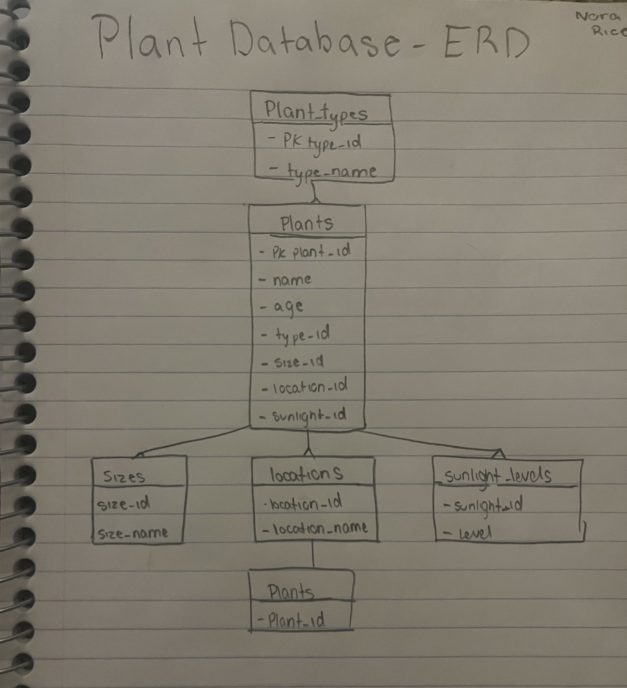
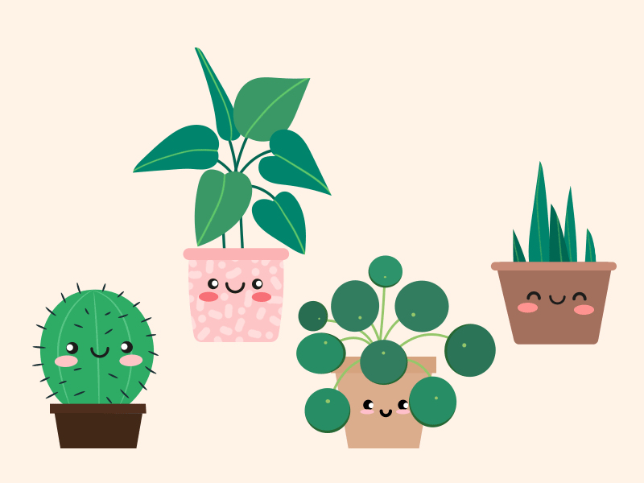
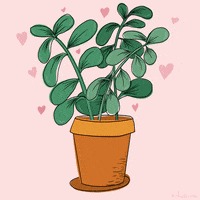

# Plants Database!

This is a Python and MySQL databse that allows users to manage a plant collection! They can view, update, add, and delete plants while story key informattion like plant name, plant type, size, location, and more!

🌱📆🪴☀️🌿💧🌱📆🪴☀️🌿💧🌱📆🪴☀️🌿💧🌱📆🪴☀️🌿💧

## ERD 
This is my created ERD (Entry Relationship Diagram), it shows the draft process of my program, that includes how each entity has a relationship to another. 

 

## You might be wondering, how do you use this plant database manager?

Below is a detailed step-by-step walkthrough of how to use the plant database manager + run the code.
  

### Requirements:
Here are NECESSARY requirements to run this application:
- Python 3
- MySQL Server
- mysql-connector-python

### First, how to run the program:

1. Save the project files, name it something relate to the porgram like "plant_manager"
2. Open your terminal
3. Navigate to the folder your saves files are in
4. Enter "python main.py" in your terminal

##  How to run/play the simulator after opening the program:

1. 🤔 | The application will ask you if you would like to add a plant, view plants, update plants, delete plants, or exit the application. Pick the number that corresponds with the choice you would like to do, type it into the "Choice:" section, and press enter.

- **Adding a Plant**:
2. ➕ | If you input 1, than you want to **add a plant!** 
- You will be asked for a plant name (Name it anything you like, it could match the color of the plants pot, when you got it, etc., make it fun!) after inputing your chosen plant nme, press enter.
- Re-type your plant name and press enter
- Enter the age of your plant (6 months, 2 years, etc., make sure to include "weeks", "months", "years", etc. after your number so that you are aware of your measurement of time and growth.).
- Then enter your chosen plants type. Listed plants include (but not limited to) Pothos, Bamboo, Cactus. If your plant is any of the pre-added types, input the number associated with that type and press enter. If your plant type is **NOT** on the pre-added list, input 0, and press enter to than add the new plant type. 
- Input the number associated with the size of you chosen plant (extra-small, small, etc.), and then press enter. 
- Input the number associated with the location of your chosen plant, if the location your plant is in does not match the pre-made list, than input 0 and press enter to add a new location, otherwise input a number from the pre-added list and press enter.
- Input the number associated with the level of sunlight your plant receives, then press enter. 
- **You have succesfully added a plant!**
**EXAMPLE:**

3. 🧐 | If you input 2, you want to **view your plants!** You can see the name of you plant first, followed by all the information you included about your plant from step 1! If you don't see your plant, than you likely interrupted your add before succesfully adding your plant. Re-input your plants information if so. 

3. 🛠️ | If you input 3, you want to **update a plant(s)!** 
- Click the ID number associated with the plant that contains information you would like to update. You can update the Name of the Plant, or the Age of the plant. 

4. 🗑️ | If you input 4, you want to **delete a plant!** 
- Click the ID number associated with the plant that you want to delete.
- You will be prompted a conformation message do make sure you DO want to DELETE your plant.
- If you are sure you want to delete your plant, input "yes" and press enter, if not, input "no" and press enter.

## Table Descriptions
 

- **plants**: stores information about individual plants (name, age, etc.)
- **plant_types**: stores plant categories (Pothos, Aloe Vera, etc.)
- **sizes**: stores plant size options
- **locations**: stores where plants are located
- **sunlight_levels**: stores sunlight requirements

## Troubleshooting
- **If MySQL connection FAILS**, check to make sure your username and password are correct, and that MySQL is running. 

- If "table doesn't exist", make sure that schema.sql has been saved.

- If Python shows an error like "mysql.connector not found", run: pip install mysql-connector-python

## Reflection
This assignment came with lots of learning, and challenges. I liked the purpose of this assignment, to demonstrate the database stuff we have been working on this past semester. As soon as I read through the list of database ideas, I immediatley new I wanted to do a plant manager database! I love plants, I have a LOT of plants, and I will most likely never stop buying plants!

As said, this assignment came with lots of learning oppurtunities. I learned a lot of stuff I did not previously know about connecting Python and MySQL, especially working through challenges of using a Windows computer at home when we've been using Linux in class. I also re-learned some simple things like how comments use different "symbols" when on different file types (.txt, .py, .sql, etc.). That was a simple topic that lead me to some confusing errors. I can't lie and say all of this code came straight from my brain either, I used tools like Google, reading informative websites, and AI to help support me in building my program. As I worked through this assignment (and honestly all assignments this year) I was able to get better at how I searched/prompted my tools to give me informative, helpful answers, but not do all my work for me.

With those learning areas, I also faced challenges, and hope to grow from them. For one, I had a time management issue (obviously since this assignment is being turned in late). With that said, I am proud of finishing this assignment and being able to turn it even if it is late. I also had some saving issues (I think that's what I could call it?). It seems like a really simple problem, and honestly it had a really simple solution... BUT, eventaully I did figure out that problem and it sped up my process by a lot! 

## Happy Plant Managing!
 
   